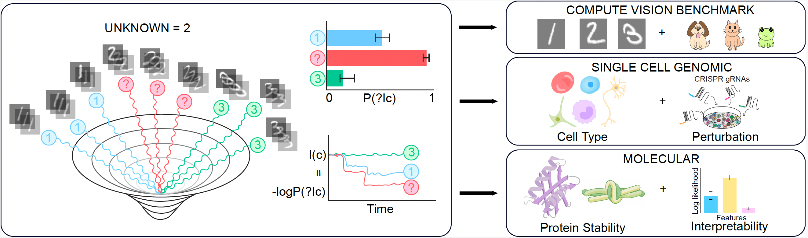

# Keeping SCORE

Code for **"Interpretable Thermodynamic Score-based Classification of Relaxation Excursions"**.

## Project Structure

> **Compute note:** Items **1, 2, and 5** can typically be run on a local machine. Items **3 and 4** are more likely to require **HPC/GPU** resources.

1. **MNIST**  
   - `VAE_MNIST.ipynb`: create VAE embeddings from MNIST  
   - `MNIST_final.ipynb`: diffusion model training, classification, and analysis (Fig. 3)

2. **CIFAR10**  
   - `CIFAR10.ipynb`: data loading, joint VAE+diffusion training, classification, analysis (Fig. 3)

3. **Cell Type Analysis (`SCTAB_FINAL`)**  
   Benchmarking scripts for cell-type classification (Fig. 4).  
   **Models:** Linear, Logistic Regression, MLP, XGBoost, scTab  
   

4. **Genetic Perturbation Analysis (`perturb-seq`)**  
   Benchmarking scripts for Perturb-seq analysis (Fig. 4).  
   **Models:** Logistic Regression, MLP, XGBoost  
   

5. **Protein Stability**  
   - `protein.ipynb`: protein stability data loading, joint VAE+diffusion regression training, analysis (Fig. 5)

## Requirements (Cell Type & Perturb-seq)

| Component | Python | Notes |
|---|---:|---|
| Cell Type Analysis | 3.8 | See `SCTAB_FINAL` environment `scTAB_environment_fixed.yml` + README |
| Perturb-seq Analysis | 3.10+ | See `perturb-seq` environment `DL_py3.10_repro.yml` + README |
| Hardware | — | GPU recommended for both; HPC likely for large runs |

## Citation
If you use this code, please cite:

> **Interpretable Thermodynamic Score-based Classification of Relaxation Excursions**  
> bioRxiv (2025). https://doi.org/10.1101/2025.11.26.690838

## License
Released under the **MIT License** (see `LICENSE`).

## Questions
Please contact **Ben Kuznets-Speck** (biophysben@gmail.com).
