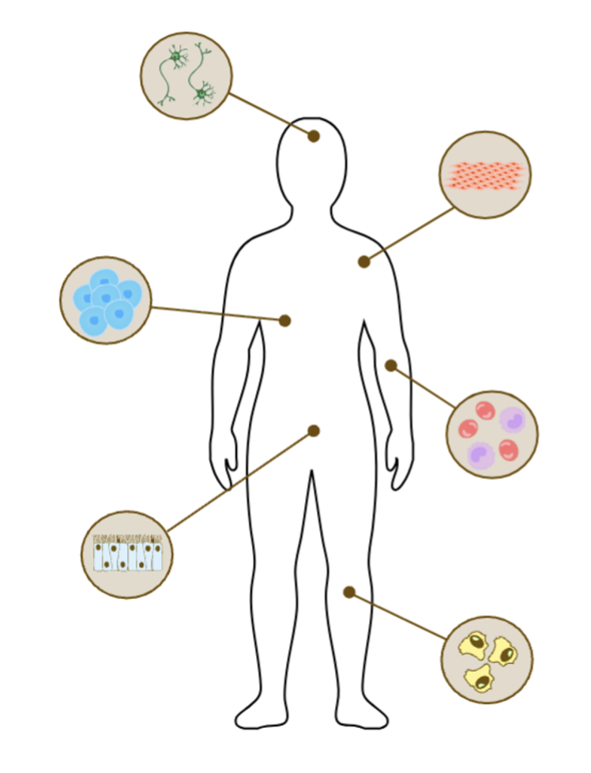

# Keeping SCORE: scRNA-seq Cell Type Analysis
## Overview
<p align="center">
  
</p>

## Requirements 
- tSNE plot for the visualization of the test embedding was executed on the high-memory RAM (1,000 GB). 
- All GPU-dependent components were executed on NVIDIA A100 GPUs.

## Environment Setup
To reproduce the Perturb-seq analysis environment, follow the steps below.

### 1. Create the Conda/Mamba environment
```bash
mamba env create --prefix $TARGET_DIR/KS_celltype --file scTAB_environment_fixed.yml
```
```bash
echo $CONDA_PREFIX
```
### 2. Activate Mamba environment 
```bash
mamba activate $TARGET_DIR/KS_celltype
```
### 3. Install Jupyter kernel support
```bash
mamba install ipykernel -y
```
```bash
python -m ipykernel install --user \
    --name KS_celltype \
    --display-name "KS_celltype"
```
#### In case of XGBoost cuda version error
```bash
CONDA_OVERRIDE_CUDA="11.1" mamba install -c conda-forge xgboost=1.6.2=cuda111* cudatoolkit=11.1
```

## Data structure
> Folders: 
- `Embedding`: Scripts for extracting **scTab embeddings** from the feature transformer (`train.py`, `val.py`, `test.py`).  
  ⚠️ Embedding extraction requires **very high memory (≥1,000 GB RAM)** and may take **multiple days** to complete.

- `Model_LogisticRegression`: Logistic Regression baseline used for benchmarking within the **scTab** framework.

- `Model_XGBoost`: XGBoost-based benchmark model used in **scTab** comparisons.

- `Model_linear`: Linear classifier used as an additional baseline model in the **scTab** setup.

- `Model_scTab`: Implementation of the original **scTab** model as described in the scTab paper.

- `Model_softmax`: Implementation of the **Keeping SCORE** model proposed in this work.

- `diffusion_model`: Training scripts and configuration files for the diffusion model used in **Keeping SCORE**.

- `emb_tb_logs`: TensorBoard logs generated during training of scTab-based models.

- `figures`: Figures used for scTab test embedding visualization (Figure 4A and Figure S3).

- `scTab-checkpoints`: Pretrained **scTab checkpoint files** downloaded from the official scTab GitHub repository.
  
   The files were obtained from: https://pklab.med.harvard.edu/felix/data/scTab-checkpoints.tar.gz (8.1 GB)

- `scTab-devel`: **scTab files** downloaded from the official scTab GitHub repository.

   The files were obtained from: https://github.com/theislab/scTab/

> Files:

- `Model_comparison_random_300.ipynb`: Notebook comparing performance across all listed models.
- `scTAB_environment_fixed.yml`: Environment setup for the cell type analysis 
   
## Data Source

Details on the **scTab** datasets and file formats are available at:  
https://github.com/theislab/scTab

For this analysis, please download the following 164GB dataset:

https://pklab.med.harvard.edu/felix/data/merlin_cxg_2023_05_15_sf-log1p.tar.gz

```bash
curl -O https://pklab.med.harvard.edu/felix/data/merlin_cxg_2023_05_15_sf-log1p.tar.gz
mv merlin_cxg_2023_05_15_sf-log1p.tar.gz $OUTPUT_DIR
```
Note that the `emb_cellnet` - `estimators.py` file is a modified version of `cellnet` from https://github.com/theislab/scTab to load the extracted embeddings instead of the raw scRNA-seq data.
