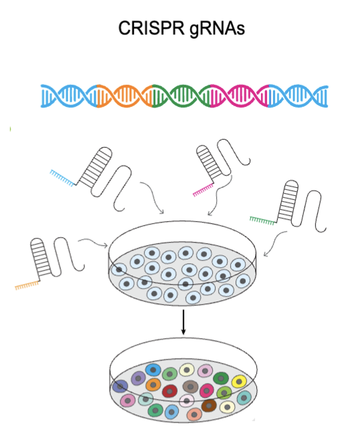

# Perturb-seq Analysis



## Overview 
This directory contains the full pipeline for **Perturb-seq analysis**, including diffusion-based representation learning, Keeping SCORE–based classification, and benchmark classifiers (MLP, XGBoost, and logistic regression).

## Requirements
All GPU-dependent components were executed on **NVIDIA A100 GPUs**.

## Environment Setup Guideline
To reproduce the Perturb-seq analysis environment, follow the steps below.

### 1. Create the Conda/Mamba environment
```bash
mamba env create -f DL_py3.10_repro.yml --prefix $TARGET_DIR/KS_perturb
```
### 2. Activate Conda environment 
```bash
mamba activate $TARGET_DIR/KS_perturb
```
### 3. Install Jupyter kernel support
```bash
mamba install ipykernel -y
python -m ipykernel install \
  --prefix=$HOME/.local \
  --name KS_perturb \
  --display-name "KS_perturb"
```

## Data structure
- `model_MLP`: This folder contains the training details of the multi-layer perceptron for benchmark.
- `model_XGB`: This folder contains the training details of the XGBoost model for benchmark.
- `model_keeping_score`: This folder contains our Keeping SCORE model training and prediction details
- `model_logistic_regression`: This folder contains the training details about the logistic regression model. 
- `0_original_data_inspection.ipynb`: the file to inspect the original dataset - `latent.h5ad` file. 
- `1_train_val_test_split.ipynb`: the file to obtain the training, validation, and test split. This file produces `_train.npy`, `_test.npy`, `_val.npy` files. 
- `2_model.ipynb`: the file to train a diffusion model. 
- `3_Classification.ipynb`: the file to perform keepingSCORE-based classification. However, it is recommended to run KeepingSCORE on HPC setting with `Uncertainty_path_4.py` in `model_keeping_score` folder.
- `model.py`: the python file of the diffusion model. This file is used for running Keeping SCORE, not for training. The model structure is identical to `2_model.ipynb`.
- `latent.h5ad`: The original latent space embedding used for this analysis.
- `DL_py3.10_repro.yml`: yml file for the environment setup.

### Notes 
* Please run the 0-3 in order.
* Running the diffusion model (`2_model.ipynb`) should precede Keeping SCORE analysis.
* Obtaining the proper train/validation/test split (`1_train_val_test_split.ipynb`) should precede all the model run. 
